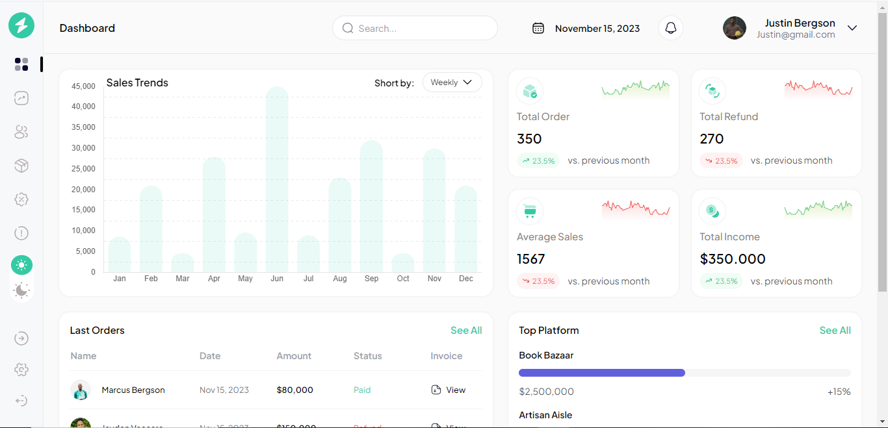
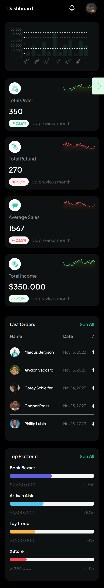

# Introduction

**This project was developed with React Js and Tailwindcss as part of the process that involves a UI challenge for an Analytical Dashboard, Sponsored by [_Geegpay by Raenest_](https://twitter.com/geegpay_hq) and [_David Herbert_](https://twitter.com/DaveyHert).**

### This project include

- [x] Assets such as svgs, images where export from figma
- [x] Google font: Plus Jakarta Sans

### Libraries installed and their implementation

1. Tailwindcss for styling.
2. ChartJs for Chart.
3. React-ChartJs for Chart.

### Preview Images

### Desktop view light and dark mode

 

 
 

### Mobile view light and dark mode

 

